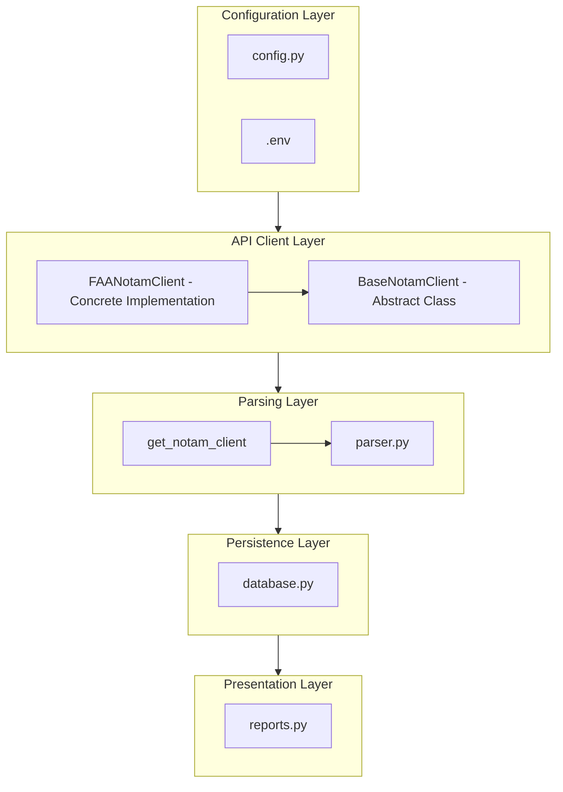
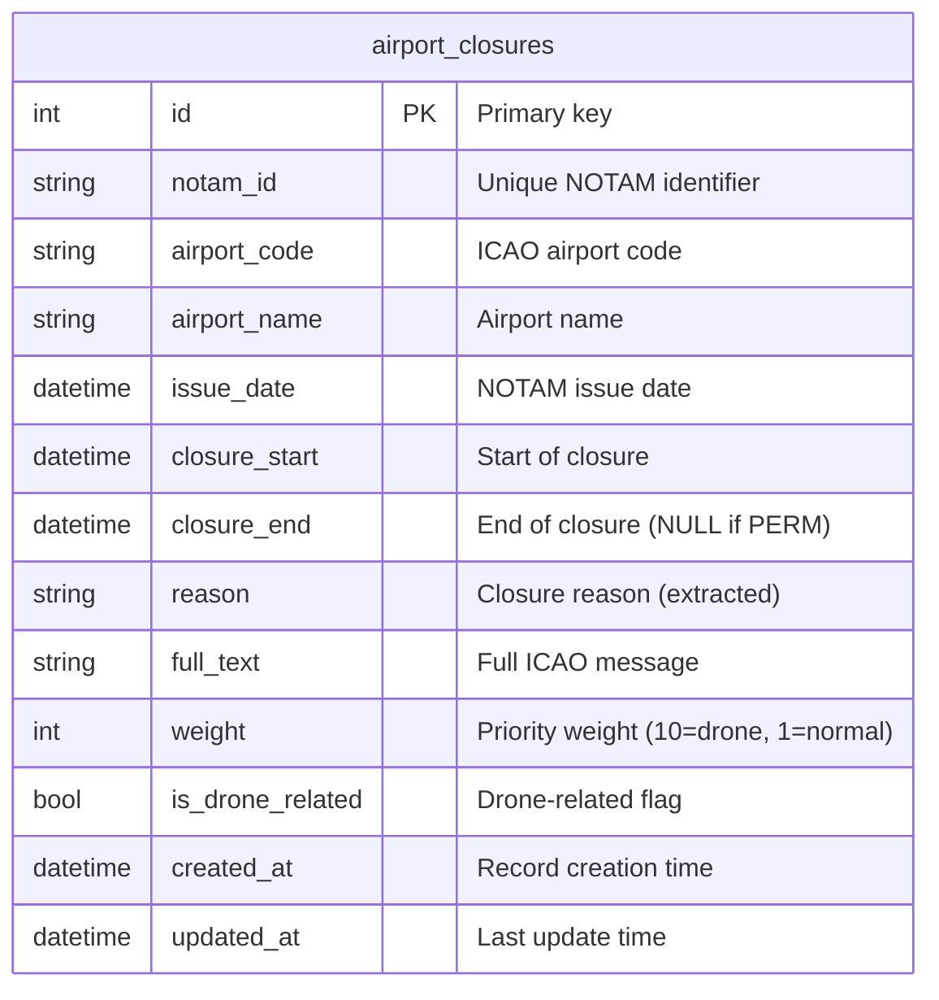

# Architecture



### Client Inheritance Pattern

The system uses an inheritance-based architecture to support different API types, when they become available:

```python
BaseNotamClient (Abstract)
    ├── FAANotamClient (No authentication - current)
    └── AuthenticatedNotamClient (Token-based - future)
```

**Current Implementation**: Uses FAA public endpoint (no authentication)

**Future Implementation**: When you get API access, just:
1. Add your `NOTAM_API_KEY` to `.env`
2. System automatically switches to `AuthenticatedNotamClient` note: some coding is going to be required!

### Rate Limiting

To avoid detection and rate limits:
- Random delays between requests (`MIN_REQUEST_DELAY` to `MAX_REQUEST_DELAY`)
- Browser-like headers
- Natural request patterns
- Configurable timing in `.env` file

### Runtime Configuration

All settings are loaded from environment variables at runtime:
- Change `.env` file
- Restart container (`make restart`)

## Drone Detection

Keywords (configurable in `.env`):

**Weight Assignment:**
- Normal closures: weight = 1
- Drone closures: weight = 10

Ensures drone-related closures appear first in all reports.

## Database Schema

### airport_closures Table



## Testing Strategy

### Unit Tests
- `test_parser.py`: FAA format parsing, drone detection
- `test_database.py`: CRUD operations, new fields

### Integration Tests
- `test_integration.py`: Complete workflows with FAA data format

**Run Tests:**
```bash
make test           # All tests
make test-unit      # Fast unit tests only
make test-coverage  # With coverage report
```