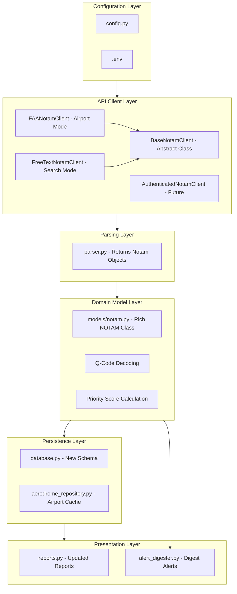
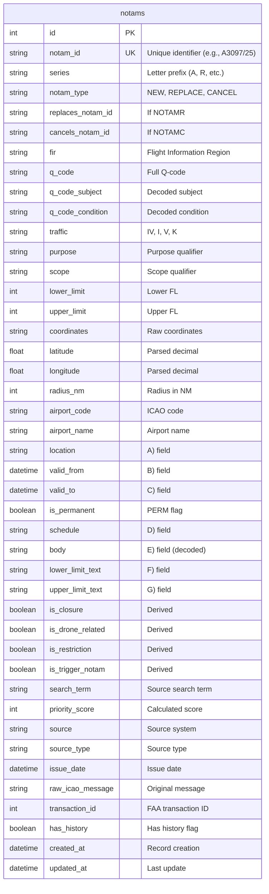
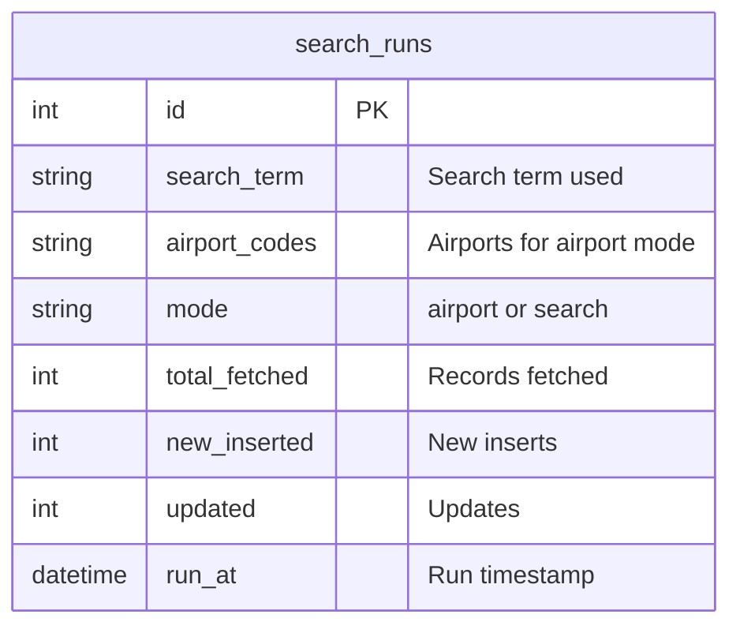
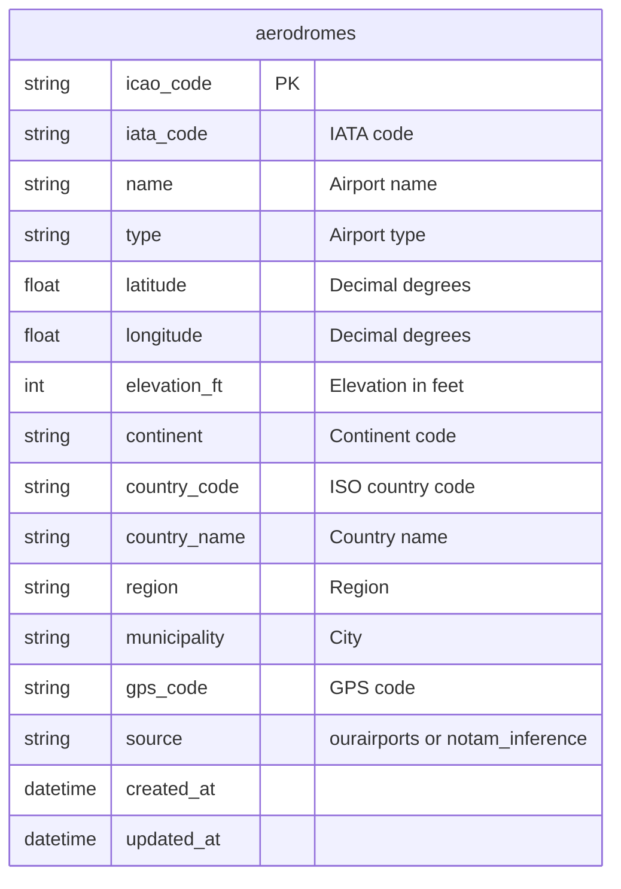

# Architecture



### Client Inheritance Pattern

The system uses an inheritance-based architecture to support different API types, when they become available:

```text
BaseNotamClient (Abstract)
    ├── FAANotamClient (Airport-based search)
    ├── FreeTextNotamClient (Free-text search)
    └── AuthenticatedNotamClient (Token-based - future)
```
- **Airport Mode** (FAANotamClient): Traditional airport-specific queries
- **Search Mode** (FreeTextNotamClient): Free-text search with automatic pagination

**Current Implementation**: Uses FAA public endpoint (no authentication)

**Future Implementation**:
1. Add a `NOTAM_API_KEY` to `.env`
2. System automatically switches to `AuthenticatedNotamClient` note: some coding is going to be required!

### Rate Limiting

To avoid detection and rate limits:
- Random delays between requests (`MIN_REQUEST_DELAY` to `MAX_REQUEST_DELAY`)
- Browser-like headers
- Natural request patterns
- Configurable timing in `.env` file

### Digest Alert System
Instead of sending individual alerts for every NOTAM, the system uses a batched digest approach:

``` text
AlertDigester
    ├── Accumulates high-priority NOTAMs (score >= NTFY_MIN_SCORE)
    ├── Sends periodic summaries every NTFY_DIGEST_INTERVAL seconds
    ├── Includes statistics (totals, closures, drone, restrictions)
    ├── Shows top N items (NTFY_MAX_DIGEST_ITEMS)
    └── Sends final digest on shutdown
```
This prevents rate limiting issues with ntfy.sh while keeping users informed.

### Understanding Priority Scores
NOTAMs are automatically scored based on their content:
|Score|Range|Meaning|Digest Inclusion|
|---|---|---|---|
|80+|Critical|Always included|
|60-79|High priority|Optional (adjust threshold)|
|40-59|Medium priority|Rarely included|
|<40|Routine|Never included|

***Example scoring:***
- Drone closure: 50 (closure) + 30 (drone) + 10 (NEW) = 90
- Normal closure: 50 (closure) + 10 (NEW) = 60
- Drone restriction: 30 (drone) + 20 (restriction) + 10 (NEW) = 60

### Runtime Configuration

All settings are loaded from environment variables at runtime:
- Change `.env` file
- Restart container (`make restart`)

## Drone Detection

Keywords (configurable in `.env`):

## Database Schema

### notams Table



### search_runs Table


### aerodromes Table


### Component Details

**alert_digester.py**

The digester runs in a background thread and accumulates NOTAMs:
python
``` python
class AlertDigester:
    def add(notam: Notam)  # Queue a NOTAM for next digest
    def send_immediate()    # Force digest send (used on shutdown)
```
**Key features:**
- Thread-safe with locks
- Tracks statistics (totals, closures, drone, restrictions)
- Deduplicates by airport
- Sanitizes titles for HTTP headers (handles Unicode)
- Falls back gracefully if ntfy is not configured

**notam_client.py**

Core model, two client implementations:
``` python
# Airport mode - fetches NOTAMs for specific ICAO codes
FAANotamClient.fetch_all_notams()

# Search mode - free-text search with pagination
FreeTextNotamClient.fetch_all_notams()  # Auto-paginates 30 records per page
```

**database.py**

Key methods for the new schema:
``` python

upsert_notam(notam: Notam)              # Insert or update with deduplication
get_active_notams(min_score: int)       # Active NOTAMs with score filter
get_closures(active_only: bool)         # Get closure NOTAMs
get_drone_notams(active_only: bool)     # Get drone-related NOTAMs
purge_expired(days: int)                # Remove old expired NOTAMs
purge_cancelled(days: int)              # Remove old cancelled NOTAMs
```


## Testing Strategy

### Unit Tests

- test_notam_model.py: NOTAM parsing, Q-code decoding, priority scoring
- test_parser.py: Returns Notam objects
- test_database.py: New schema operations

### Integration Tests

- test_integration.py: Complete workflows with new data structures

**Run Tests:**
```bash
make test           # All tests
make test-unit      # Fast unit tests only
make test-coverage  # With coverage report
```